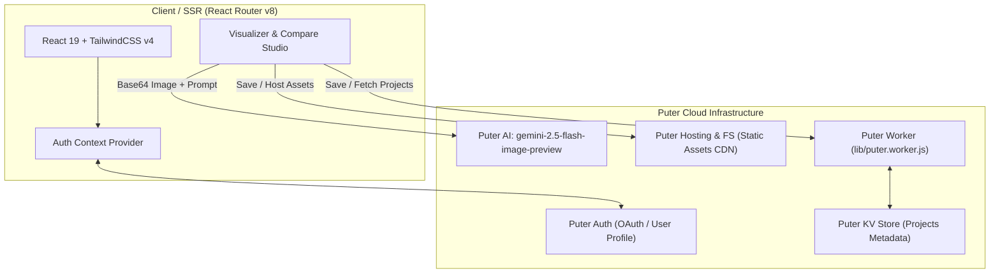

# Roomify Production & Deployment Guide

A comprehensive architectural reference, deployment guide, and production readiness checklist for **Roomify**.

---

## Table of Contents
1. [Project Overview](#1-project-overview)
2. [Architecture & Tech Stack](#2-architecture--tech-stack)
3. [Component & Directory Structure](#3-component--directory-structure)
4. [Core Subsystems Deep Dive](#4-core-subsystems-deep-dive)
5. [Environment Variables & Configuration](#5-environment-variables--configuration)
6. [Deployment Procedures](#6-deployment-procedures)
   - [Docker Deployment](#option-1-docker-deployment)
   - [Node.js VPS / PM2 Deployment](#option-2-nodejs-vps--pm2-deployment)
   - [Puter Worker Backend Deployment](#option-3-puter-worker-backend-deployment)
7. [Production Readiness Checklist & Code Gotchas](#7-production-readiness-checklist--code-gotchas)

---

## 1. Project Overview

**Roomify** is an AI-powered interior architectural visualization platform that transforms 2D floor plans into photorealistic, top-down 3D architectural renders.

### Core User Journey
1. **Authentication:** User authenticates via Puter.js identity services.
2. **Floor Plan Ingestion:** User uploads a floor plan (JPG/PNG/WebP format, up to 50MB) via drag-and-drop.
3. **AI Generation:** The floor plan is passed to Google Gemini (`gemini-2.5-flash-image-preview`) with architectural prompt constraints to extrude walls, interpret room icons, and render realistic materials and lighting.
4. **Interactive Studio:** User compares the 2D original against the 3D render using an interactive split-slider, exports high-resolution PNGs, and saves the project to their personal cloud portfolio.

---

## 2. Architecture & Tech Stack



### Technology Matrix

| Layer | Technology | Key Dependencies |
| :--- | :--- | :--- |
| **Framework** | React Router v8 (SSR enabled) | `@react-router/node`, `@react-router/serve`, `react-router` |
| **Frontend Runtime** | React 19 | `react`, `react-dom`, `lucide-react` |
| **Styling** | Tailwind CSS v4 + Custom CSS | `@tailwindcss/vite`, `tailwindcss`, `app/app.css` |
| **AI Model & Provider** | Google Gemini via Puter.js | `@heyputer/puter.js`, `gemini-2.5-flash-image-preview` |
| **Backend & Storage** | Puter Cloud Services | Puter Worker API, Puter KV Store, Puter Hosting (`.puter.site`) |
| **Comparison Slider** | React Compare Slider | `react-compare-slider` |
| **Build & Tooling** | Vite 8 + TypeScript 5.9 | `vite`, `typescript`, `@react-router/dev` |
| **Containerization** | Docker (Node 24 Alpine) | Multi-stage build in `Dockerfile` |

---

## 3. Component & Directory Structure

```
Roomify/
├── app/
│   ├── components/
│   │   ├── ui/
│   │   │   └── button.tsx           # Reusable button with variants (primary, ghost, outline)
│   │   ├── navbar.tsx              # Navigation bar + Puter Auth trigger
│   │   └── upload.tsx              # Drag-and-drop floor plan uploader with progress animation
│   ├── routes/
│   │   ├── home.tsx                # Landing page + Project gallery
│   │   └── visualizer.$id.tsx      # Visualizer studio (3D render, comparison slider, export)
│   ├── app.css                     # Global styles, animations, design tokens
│   ├── root.tsx                    # Root Layout, HTML shell, Auth Provider & Context
│   └── routes.ts                   # Route configuration (Home + Visualizer)
├── lib/
│   ├── ai.action.ts                # Puter AI txt2img call (Gemini 2.5 flash preview)
│   ├── constants.ts               # Render prompts, timeouts, storage paths, worker URL
│   ├── puter.action.ts             # Puter client SDK wrappers (auth, project fetch/save)
│   ├── puter.hosting.ts            # Puter CDN hosting & filesystem upload helpers
│   ├── puter.worker.js             # Serverless backend router for project save/list/get
│   └── utils.ts                    # Blob conversions, image extensions, hosting slugs
├── public/                         # Static assets (favicons, robots.txt, etc.)
├── Dockerfile                      # Production Docker multi-stage container
├── package.json                    # Scripts and dependencies
├── react-router.config.ts          # React Router SSR configuration
└── vite.config.ts                  # Vite + Tailwind plugin setup
```

---

## 4. Core Subsystems Deep Dive

### A. Authentication (`app/root.tsx`, `lib/puter.action.ts`)
- Auth state is managed globally and exposed to all routes through `useOutletContext<AuthContext>()`.
- Directly connects with `puter.auth.signIn()`, `puter.auth.signOut()`, and `puter.auth.getUser()`.
- Upload and generation workflows check for active authentication, safeguarding against unauthorized resource utilization.

### B. AI Rendering Engine (`lib/ai.action.ts`, `lib/constants.ts`)
- Reads the floor plan image as Base64/DataURL.
- Sends payload to `puter.ai.txt2img(ROOMIFY_RENDER_PROMPT, ...)` with:
  - `provider`: `'gemini'`
  - `model`: `'gemini-2.5-flash-image-preview'`
  - `ratio`: `{ w: 1024, h: 1024 }`
- **System Prompt Rules:** Extrudes walls precisely from plan lines, removes all text/dimensions/labels, maps fixture icons (beds, sinks, tables, sofas) into realistic furniture, and enforces an orthographic top-down daylight architectural render.

### C. Cloud Storage & Asset Hosting (`lib/puter.hosting.ts`)
- Dynamically provisions or fetches a dedicated Puter hosting site (`roomify-<slug>.puter.site`) stored in KV (`roomify_hosting_config`).
- Converts data URLs to Blobs and writes them to the Puter filesystem under `projects/<projectId>/source.<ext>` and `projects/<projectId>/rendered.<ext>`.
- Generates and persists public CDN HTTPS URLs for reliable, fast delivery.

### D. Serverless Backend Worker (`lib/puter.worker.js`)
Exposes REST endpoints running in the Puter Serverless Worker:
- `POST /api/projects/save` — Validates Puter auth, persists project metadata to `roomify_project_<id>` in KV.
- `GET /api/projects/list` — Lists all projects belonging to the authenticated user.
- `GET /api/projects/get?id=<id>` — Fetches a single project by ID.

---

## 5. Environment Variables & Configuration

Create a `.env` file for local development and define these in your deployment platform:

```env
# URL where your deployed puter.worker.js is hosted
VITE_PUTER_WORKER_URL=https://roomify-ai-worker.puter.work

# Node environment (production servers)
NODE_ENV=production
PORT=3000
```

> **Important:** The `VITE_PUTER_WORKER_URL` environment variable must be set at build time (Vite embeds `import.meta.env.VITE_*` during `react-router build`).

---

## 6. Deployment Procedures

### Option 1: Docker Deployment
*Ideal for AWS ECS, Google Cloud Run, Azure Container Apps, DigitalOcean App Platform, Fly.io, Railway.*

The repository includes a production multi-stage `Dockerfile`:

1. **Build Container Image:**
   ```bash
   docker build --build-arg VITE_PUTER_WORKER_URL=https://your-worker.puter.work -t roomify:latest .
   ```

2. **Run Container Locally or on Server:**
   ```bash
   docker run -d -p 3000:3000 -e PORT=3000 --name roomify-app roomify:latest
   ```

---

### Option 2: Node.js VPS / PM2 Deployment
*Ideal for Ubuntu/Debian VPS, AWS EC2, or bare-metal servers.*

1. **Install Dependencies & Build Production Bundle:**
   ```bash
   npm ci
   npm run build
   ```

2. **Run with PM2:**
   ```bash
   npm install -g pm2
   pm2 start "npm run start" --name "roomify"
   pm2 save
   pm2 startup
   ```

3. **Configure Nginx Reverse Proxy with SSL (Certbot):**
   ```nginx
   server {
       listen 80;
       server_name yourdomain.com;

       location / {
           proxy_pass http://127.0.0.1:3000;
           proxy_http_version 1.1;
           proxy_set_header Upgrade $http_upgrade;
           proxy_set_header Connection 'upgrade';
           proxy_set_header Host $host;
           proxy_cache_bypass $http_upgrade;
           proxy_set_header X-Real-IP $remote_addr;
           proxy_set_header X-Forwarded-For $proxy_add_x_forwarded_for;
           proxy_set_header X-Forwarded-Proto $scheme;
       }
   }
   ```

---

### Option 3: Puter Worker Backend Deployment
1. Deploy `lib/puter.worker.js` directly to the **Puter Worker dashboard / CLI**.
2. Note the generated subdomain URL (e.g. `https://roomify-ai-worker.puter.work`).
3. Set that URL as `VITE_PUTER_WORKER_URL` in your frontend environment.

---

## 7. Production Readiness Checklist & Code Gotchas

### 1. Code Fixes & Safety Gotchas
- [ ] **Fix variable reference bug in `lib/puter.worker.js:50`:**
  In the `catch (error)` block, change `e.message` to `error.message` to avoid throwing a `ReferenceError`.
- [ ] **Dynamic Author Attribution in `app/routes/home.tsx:140`:**
  Replace static `<span>BY JUNAID</span>` with dynamic project author or current user's name (`userName || 'User'`).
- [ ] **Implement Share Handler in `app/routes/visualizer.$id.tsx:182`:**
  The Share button currently has an empty `onClick={() => {}}` callback. Add clipboard copy or Web Share API functionality.

### 2. SEO & Meta Tags
- [ ] Update title and meta description in `app/routes/home.tsx:11-16` (currently default `"New React Router App"`).
- [ ] Add Open Graph (`og:image`, `og:title`, `og:description`) and Twitter card meta tags in `app/root.tsx`.
- [ ] Add a `favicon.ico` / `favicon.svg` and web app manifest in `public/`.

### 3. Error Handling & Edge Cases
- [ ] **AI Timeout & Failures:** Handle cases where `puter.ai.txt2img` times out or returns non-200 by adding a user-facing retry toast or alert banner in `app/routes/visualizer.$id.tsx`.
- [ ] **Large Payload Protection:** Prevent browser memory spikes by validating image dimensions and file sizes (e.g., client-side downscaling floor plans larger than 4K before conversion).
- [ ] **Session Expiry:** Gracefully handle Puter auth token expiration during ongoing generation requests.
