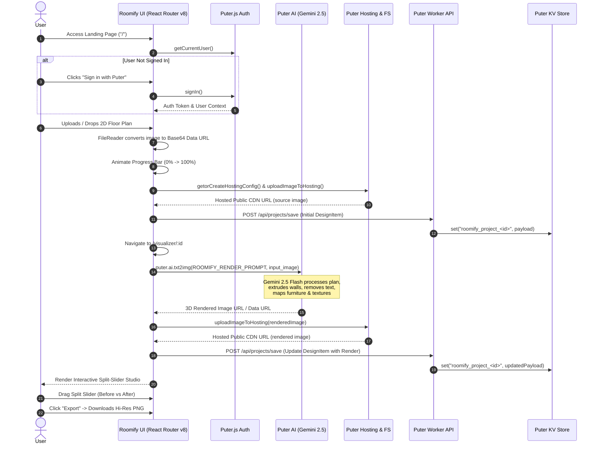

# Roomify — Project Summary & Architecture Blueprint

> **Roomify** is an AI-powered architectural visualization platform designed to transform flat 2D floor plans into photorealistic, top-down 3D architectural renders in seconds.

---

## 1. Executive Summary & Vision

### What is Roomify?
Roomify bridges the gap between technical 2D architectural blueprints and intuitive, photorealistic 3D interior renders. By integrating **React 19**, **React Router v8 (SSR)**, and **Google Gemini 2.5 Flash Image Preview** via **Puter.js Cloud Services**, Roomify automates the extrusion of walls, furniture mapping, lighting setup, and material texturing without requiring complex CAD or 3D modeling software (like Blender, 3ds Max, or SketchUp).

### Core Value Proposition
- **Frictionless Blueprint Conversion:** Ingests JPG, PNG, and WebP architectural plans and yields top-down 3D isometric/orthographic renders.
- **Strict Prompt Engineering & Geometry Preservation:** Enforces exact wall alignments, removes blueprint clutter (dimensions, text annotations), and realistically maps 2D CAD symbols to 3D furniture.
- **Serverless Cloud Native Stack:** Leverages Puter.js for zero-server setup — handling OAuth authentication, serverless microservice workers, distributed KV storage, and file hosting on public CDNs (`.puter.site`).
- **Interactive Visualizer Studio:** Side-by-side interactive split slider comparing the 2D schematic original against the 3D photorealistic render, with one-click high-resolution PNG export.

---

## 2. End-to-End System & User Flow



### Flow Breakdown Step-by-Step:

1. **Authentication Layer:**
   - On app mount (`app/root.tsx`), `refreshAuth()` calls `puter.auth.getUser()`.
   - Global auth state (`isSignedIn`, `userName`, `userId`, `signIn`, `signOut`) is passed to all child routes via React Router's `Outlet` context.
   - Floor plan upload is gated until user authentication is verified.

2. **Floor Plan Ingestion (`app/components/upload.tsx` & `app/routes/home.tsx`):**
   - Supports Drag-and-Drop or direct file selection for `.jpg`, `.jpeg`, `.png`, and `.webp` (up to 50MB).
   - Reads file into a Base64 string via browser `FileReader`.
   - Simulates smooth animated progress state from 0% to 100% using `PROGRESS_STEP` and `PROGRESS_INTERVAL_MS`.
   - Generates a timestamped project (`Residence <id>`), uploads the source asset to the user's Puter hosting storage, saves project metadata, and redirects to `/visualizer/:id`.

3. **AI Generation Pipeline (`lib/ai.action.ts` & `lib/constants.ts`):**
   - In `/visualizer/:id`, the component triggers `generate3DView()`.
   - Base64 payload and MIME type are extracted and passed to `puter.ai.txt2img()`.
   - Uses `provider: 'gemini'`, `model: 'gemini-2.5-flash-image-preview'`, and aspect ratio `1024x1024`.
   - The strict prompt ensures geometry alignment, wall extrusion, text removal, door swing conversion, and room mapping (beds, sectionals, kitchen counters, sanitaryware, etc.).

4. **Asset Hosting & CDN Provisioning (`lib/puter.hosting.ts`):**
   - Checks KV for existing hosting configuration (`roomify_hosting_config`).
   - If missing, provisions a unique subdomain (`roomify-<slug>.puter.site`) via `puter.hosting.create()`.
   - Converts image data URLs to PNG blobs and writes them to Puter filesystem (`projects/<projectId>/source.<ext>` & `projects/<projectId>/rendered.png`).
   - Returns persistent public HTTPS URLs.

5. **Project Persistence & State Management (`lib/puter.worker.js` & `lib/puter.action.ts`):**
   - Project metadata is synced through Puter serverless workers into Puter KV store under `roomify_project_<id>`.
   - Home page lists user's previous projects with instant visual cards.

6. **Interactive Studio & Visualizer (`app/routes/visualizer.$id.tsx`):**
   - **Render Stage:** Displays full rendered 3D view with animated processing spinners.
   - **Split-Screen Studio:** Powered by `ReactCompareSlider` and `ReactCompareSliderImage`, allowing users to drag a slider handle to inspect original 2D blueprints against the 3D render.
   - **Export Engine:** One-click blob generation and download triggering `roomify-render-<id>.png`.

---

## 3. Technology Matrix

| Layer | Technology / Library | Purpose & Implementation |
| :--- | :--- | :--- |
| **Frontend Framework** | **React Router v8** (SSR Mode) | File-based routing, nested layout context, server-side rendering, and production serving. |
| **UI Library & Components** | **React 19** + **Lucide React** | React 19 hooks (`useRef`, `useState`, `useEffectEvent`), modern reactive components, and clean icons. |
| **Styling & Design System** | **Tailwind CSS v4** + `app.css` | Custom dark modern theme, glassmorphism, glowing accents, grid overlays, pulse badges, and keyframe animations. |
| **AI Rendering Engine** | **Google Gemini 2.5 Flash Image Preview** | Multimodal image-to-image synthesis executed through Puter AI SDK (`puter.ai.txt2img`). |
| **Cloud Platform & Auth** | **Puter.js SDK** (`@heyputer/puter.js`) | Zero-backend cloud services: Puter Auth, Puter KV, Puter Filesystem, and Puter Hosting. |
| **Comparison Slider** | **React Compare Slider** | Interactive dual-layer comparison slider for 2D vs 3D inspection. |
| **Serverless Backend** | **Puter Worker Router** | Lightweight serverless microservice router (`lib/puter.worker.js`) executing KV operations. |
| **Build & Tooling** | **Vite 8** + **TypeScript 5.9** | Ultra-fast HMR, strict typechecking, and optimized production bundling. |
| **Containerization** | **Docker** (Node 24 Alpine) | Multi-stage production container build. |

---

## 4. Codebase Architecture & Directory Map

```
Roomify/
├── app/
│   ├── components/
│   │   ├── ui/
│   │   │   └── button.tsx           # Button UI component with variants (primary, secondary, ghost, outline)
│   │   ├── navbar.tsx              # Brand header, navigation links, and Puter OAuth trigger
│   │   └── upload.tsx              # Drag & drop uploader with progress animation and format validation
│   ├── routes/
│   │   ├── home.tsx                # Hero banner, feature callout, uploader shell, and projects gallery
│   │   └── visualizer.$id.tsx      # Studio visualizer, 3D AI generator, compare slider, and PNG export
│   ├── app.css                     # Complete design tokens, dark theme variables, and custom CSS classes
│   ├── root.tsx                    # Root HTML layout, font preconnects, AuthContext provider, ErrorBoundary
│   └── routes.ts                   # Route definition mapping ("/" -> home.tsx, "/visualizer/:id" -> visualizer.$id.tsx)
├── lib/
│   ├── ai.action.ts                # AI integration with puter.ai.txt2img (Gemini 2.5 Flash preview)
│   ├── constants.ts               # Render prompts, storage paths, progress intervals, grid settings
│   ├── puter.action.ts             # Puter SDK client operations (signIn, signOut, createProject, getProjects, getProjectById)
│   ├── puter.hosting.ts            # Puter CDN hosting setup, FS directory creation, and Blob upload pipeline
│   ├── puter.worker.js             # Serverless backend worker (REST endpoints for project CRUD)
│   └── utils.ts                    # Helpers for Blob parsing, dataURL conversion, mime/extension resolution, slug generation
├── prompts/
│   ├── promptssaver.md             # Developer workflow specifications & prompt log
│   └── summary.md                  # Complete project summary & architecture blueprint (this document)
├── public/                         # Static web assets
├── Dockerfile                      # Multi-stage production Docker container
├── package.json                    # Project configuration & npm scripts
├── productionguide.md              # Production deployment reference and checklists
├── react-router.config.ts          # React Router v8 configuration (SSR enabled)
├── tsconfig.json                   # Strict TypeScript compiler configuration
├── type.d.ts                       # Global TypeScript declarations and interfaces
└── vite.config.ts                  # Vite build and Tailwind plugin configuration
```

---

## 5. Core Subsystems Deep Dive

### 5.1 Authentication & User Context
- **Location:** `app/root.tsx`, `lib/puter.action.ts`
- **Mechanism:** Integrates directly with Puter Auth. When users log in via `puter.auth.signIn()`, user metadata is extracted (`username`, `userId`/`uuid`) and stored in React state.
- **Context Propagation:** Provided via `Outlet context`:
  ```typescript
  type AuthContext = {
    isSignedIn: boolean;
    userName: string | null;
    userId: string | null;
    refreshAuth: () => Promise<boolean>;
    signIn: () => Promise<boolean>;
    signOut: () => Promise<boolean>;
  };
  ```

### 5.2 AI Prompt Engineering & Rendering Pipeline
- **Location:** `lib/ai.action.ts`, `lib/constants.ts`
- **Model:** `gemini-2.5-flash-image-preview` (via Puter AI)
- **Engine Rules:**
  1. **Text & Annotation Removal:** Completely strips numbers, room tags, dimensions, and architectural marks, replacing them with seamless continuous flooring.
  2. **Strict Geometric Alignment:** Retains exact door, wall, window, and opening positions.
  3. **Orthographic Top-Down Projection:** Ensures a clean 90-degree top-down architectural perspective with zero distortion.
  4. **Fixture-to-Furniture Semantic Mapping:**
     - Bed icons $\rightarrow$ Crisp 3D beds with duvets and pillows
     - Sofa/Living symbols $\rightarrow$ Modern sectionals and coffee tables
     - Dining icons $\rightarrow$ Tables with surrounding chairs
     - Kitchen fixtures $\rightarrow$ Counters, sinks, stoves, and cabinetry
     - Bathroom fixtures $\rightarrow$ Sinks, toilets, and showers/bathtubs
  5. **Atmosphere & Lighting:** Daylight architectural rendering with subtle ambient occlusion shadows, realistic wood/tile materials, and clean drywall finishes.

### 5.3 CDN Asset Hosting & Filesystem Storage
- **Location:** `lib/puter.hosting.ts`, `lib/utils.ts`
- **Mechanism:**
  - Auto-allocates or reads a dedicated hosting site (`roomify-<slug>.puter.site`) stored in KV (`roomify_hosting_config`).
  - Converts data URLs and Base64 payloads to native `Blob` / `File` objects.
  - Creates directories under `projects/<projectId>/` in Puter FS.
  - Outputs public immutable CDN HTTPS URLs for both `source` and `rendered` assets.

### 5.4 Serverless Worker & Project Storage API
- **Location:** `lib/puter.worker.js`, `lib/puter.action.ts`
- **Endpoints:**
  - `POST /api/projects/save`: Persists project object to KV key `roomify_project_<id>` with updated timestamps.
  - `GET /api/projects/list`: Queries all KV keys with `roomify_project_*` prefix and returns user project history.
  - `GET /api/projects/get?id=<id>`: Retrieves single project record by ID.

---

## 6. TypeScript Data Models (`type.d.ts`)

```typescript
interface DesignItem {
  id: string;
  name?: string | null;
  sourceImage: string;
  sourcePath?: string | null;
  renderedImage?: string | null;
  renderedPath?: string | null;
  publicPath?: string | null;
  timestamp: number;
  ownerId?: string | null;
  sharedBy?: string | null;
  sharedAt?: string | null;
  isPublic?: boolean;
}

interface AuthState {
  isSignedIn: boolean;
  userName: string | null;
  userId: string | null;
}

interface HostingConfig {
  subdomain: string;
}

interface StoreHostedImageParams {
  hosting: HostingConfig | null;
  url: string;
  projectId: string;
  label: "source" | "rendered";
}

interface CreateProjectParams {
  item: DesignItem;
  visibility?: "private" | "public";
}

interface Generate3DViewParams {
  sourceImage: string;
  projectId?: string | null;
}
```

---

## 7. Environment Variables & Production Deployment

### Environment Configuration
Defined in `.env`:
```env
# Deployed Puter Worker URL
VITE_PUTER_WORKER_URL=https://roomify-ai-worker.puter.work

# Production server settings
NODE_ENV=production
PORT=3000
```

### Deployment Options
1. **Docker Container Deployment:**
   - Multi-stage Docker build utilizing `node:24-alpine`.
   - `docker build --build-arg VITE_PUTER_WORKER_URL=https://your-worker.puter.work -t roomify:latest .`
   - `docker run -d -p 3000:3000 --name roomify-app roomify:latest`
2. **Node.js VPS (PM2 + Nginx):**
   - `npm ci && npm run build`
   - Managed via PM2: `pm2 start "npm run start" --name "roomify"`
   - Nginx reverse proxy routing requests to `http://127.0.0.1:3000` with SSL.
3. **Puter Worker Deployment:**
   - Deploy `lib/puter.worker.js` to Puter Worker dashboard/CLI to obtain worker subdomain.

---

## 8. Summary of Key Strengths & Production Readiness
- **Zero Heavy Backend Overhead:** Everything is serverless, fast, and scalable through Puter Cloud Services.
- **State-of-the-Art UX:** Sleek dark-mode aesthetic with responsive micro-animations and split-screen comparison studio.
- **Robust AI Transformation:** Precise prompt constraints prevent hallucinated rooms and preserve plan geometry.
- **Modularity:** Clear separation of concerns across AI actions, Puter hosting, serverless worker routines, and React components.
